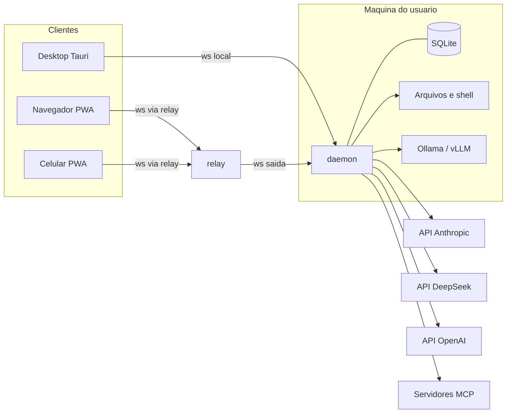

# 02. Arquitetura

## Visao geral



Tres blocos:

1. **Clientes.** Uma unica interface Vue empacotada de tres formas: dentro do
   Tauri no desktop, servida como PWA no navegador, instalada como PWA no
   celular. O cliente nao chama provedor nenhum. Ele so fala com o daemon.
2. **Daemon.** Processo Node na maquina do usuario. Roda o loop de agente,
   chama provedores, executa ferramentas, grava tudo no SQLite e transmite
   eventos para os clientes conectados. E a fonte da verdade.
3. **Relay.** Servidor pequeno e sem estado. O daemon abre uma conexao de
   saida para ele. Clientes remotos conectam no relay, que encaminha quadros
   de um lado para o outro. Nao le, nao guarda, nao decide nada.

## Por que o daemon e separado da interface

- O desktop, o navegador e o celular precisam ver o mesmo estado. Se o loop
  rodasse dentro da interface, cada dispositivo teria seu proprio historico.
- Execucao remota exige um processo sempre vivo na maquina alvo. O daemon e
  esse processo. O desktop apenas o sobe como sidecar.
- Chaves de API ficam apenas no daemon. Nenhum cliente as recebe.

## Camadas do core

O repositorio `core` e uma biblioteca sem I/O de rede proprio alem dos SDKs
dos provedores. O daemon a consome.

```
core
  providers/     ProviderAdapter e implementacoes (anthropic, openai-compatible)
  loop/          AgentRunner: chama provedor, executa ferramentas, aplica orcamento
  cost/          Pricing, Ledger, Budget
  tools/         ToolRegistry, ferramentas nativas, ponte MCP
  agents/        Carregamento e validacao de perfis
  context/       Contagem, compactacao e poda de contexto
```

### ProviderAdapter

Interface unica que todo provedor implementa. E o unico lugar que conhece o
formato de cada API.

```ts
interface ProviderAdapter {
  id: string
  chat(req: ChatRequest, on: ChatEvents): Promise<ChatResult>
  countTokens?(req: ChatRequest): Promise<number>
  capabilities(): Capabilities
}

interface ChatResult {
  message: AssistantMessage
  toolCalls: ToolCall[]
  stopReason: 'end' | 'tool' | 'max_output' | 'refusal' | 'error'
  usage: Usage
  raw?: unknown
}

interface Usage {
  input: number
  output: number
  cacheRead: number
  cacheWrite: number
  reasoning: number
}
```

`Usage` e normalizado a partir do campo de uso de cada API. O adaptador nunca
estima; ele le o que o provedor devolve. Mapeamento inicial:

| Provedor | Campo de origem |
|----------|-----------------|
| Anthropic | `usage.input_tokens`, `output_tokens`, `cache_read_input_tokens`, `cache_creation_input_tokens` |
| DeepSeek | `usage.prompt_tokens`, `completion_tokens`, `prompt_cache_hit_tokens`, `prompt_cache_miss_tokens`, `completion_tokens_details.reasoning_tokens` |
| OpenAI | `usage.prompt_tokens`, `completion_tokens`, `prompt_tokens_details.cached_tokens`, `completion_tokens_details.reasoning_tokens` |
| Ollama (modo OpenAI) | `usage.prompt_tokens`, `completion_tokens` |

Dois adaptadores cobrem os tres agentes iniciais: `anthropic` (SDK oficial
`@anthropic-ai/sdk`) e `openai-compatible` (SDK oficial `openai` com
`baseURL` configuravel, usado por DeepSeek, OpenAI e Ollama).

### AgentRunner

Loop unico, independente de provedor:

```
run(sessao, mensagemUsuario):
  perfil = registry.get(sessao.agente)
  contexto = context.build(sessao, perfil)
  repetir ate parar ou atingir perfil.maxSteps:
    budget.assertBeforeCall(estimativa)
    resultado = adapter.chat(contexto, eventos)
    ledger.record(resultado.usage, precos)
    budget.assertAfterCall()
    se resultado.stopReason != 'tool': parar
    para cada toolCall:
      decisao = policy.decide(perfil, toolCall)
      se decisao == 'ask': aguardar aprovacao do cliente
      resultado = tools.execute(toolCall)
      contexto.append(toolResult)
```

O runner emite eventos (`text_delta`, `tool_call`, `tool_result`,
`usage`, `approval_required`, `run_finished`) que o daemon repassa aos
clientes.

## Protocolo daemon e clientes

WebSocket com quadros JSON. Um unico protocolo para desktop, navegador e
celular. O relay apenas encaminha os mesmos quadros.

Cliente para daemon:

| Tipo | Conteudo |
|------|----------|
| `auth` | token do dispositivo |
| `session.create` | agente, workspace |
| `session.list`, `session.get` | paginacao |
| `run.start` | sessao, mensagem do usuario |
| `run.cancel` | id do run |
| `approval.respond` | id, `allow` ou `deny`, opcional `allow_always` |
| `budget.override` | escopo, novo limite |
| `agents.list`, `cost.report` | filtros |
| `skill.load` | sessao, nome da skill |
| `schedule.list`, `schedule.upsert`, `schedule.delete`, `schedule.run_now` | agendamento |
| `trigger.list`, `trigger.upsert`, `trigger.delete` | gatilho externo |
| `automation.pause`, `automation.resume` | interruptor geral |

Relay para daemon:

| Tipo | Conteudo |
|------|----------|
| `trigger.fire` | id do gatilho, cabecalhos e corpo bruto do webhook |

Daemon para clientes (broadcast para todos os conectados na mesma conta):

| Tipo | Conteudo |
|------|----------|
| `event` | qualquer evento do runner, com `session_id`, `run_id`, `seq` |
| `approval.required` | ferramenta, argumentos, expiracao |
| `budget.warning`, `budget.exceeded` | escopo, gasto, limite |
| `session.updated` | resumo para lista |
| `automation.started`, `automation.finished`, `automation.error` | tipo, id da automacao, sessao, custo |

O quadro `auth` carrega `protocol_version`. Daemon e cliente recusam
versoes incompativeis com mensagem clara. Detalhes de automacao em
`10-automacao.md`; extensoes em `09-extensoes.md`.

Cada evento carrega `seq` crescente por sessao. Um cliente que reconecta
envia o ultimo `seq` conhecido e recebe o que perdeu. Isso e a base da
sincronizacao, detalhada em `05-sincronizacao.md`.

## Persistencia

SQLite no daemon, um arquivo por instalacao. Tabelas iniciais:

- `sessions` (id, agent, workspace, title, created_at, updated_at)
- `messages` (id, session_id, seq, role, content_json, created_at)
- `tool_events` (id, session_id, run_id, name, args_json, result_json, status)
- `ledger` (id, ts, session_id, run_id, agent, provider, model, input,
  output, cache_read, cache_write, reasoning, cost_usd, latency_ms)
- `budgets` (scope, key, limit_usd, limit_tokens, period)
- `approvals` (id, session_id, tool, args_hash, decision, remembered)
- `devices` (id, name, token_hash, last_seen)

## Fluxo de uma tarefa remota

1. Usuario abre o PWA no celular, escolhe o dispositivo "PC casa" e o agente
   `deepseek-dev`, digita a tarefa.
2. Cliente envia `run.start` ao relay, relay encaminha ao daemon do PC.
3. Daemon roda o loop. Cada delta de texto e evento volta pelo mesmo caminho.
4. Agente pede `run_command`. Politica do perfil diz `ask`. Daemon emite
   `approval.required`. Celular mostra o comando. Usuario aprova.
5. Daemon executa no workspace permitido, devolve resultado ao agente.
6. Ledger registra cada chamada. Painel de custo do celular atualiza.
7. Usuario abre o desktop depois. Mesma sessao, mesmo historico, mesmo custo,
   porque tudo esta no daemon.
