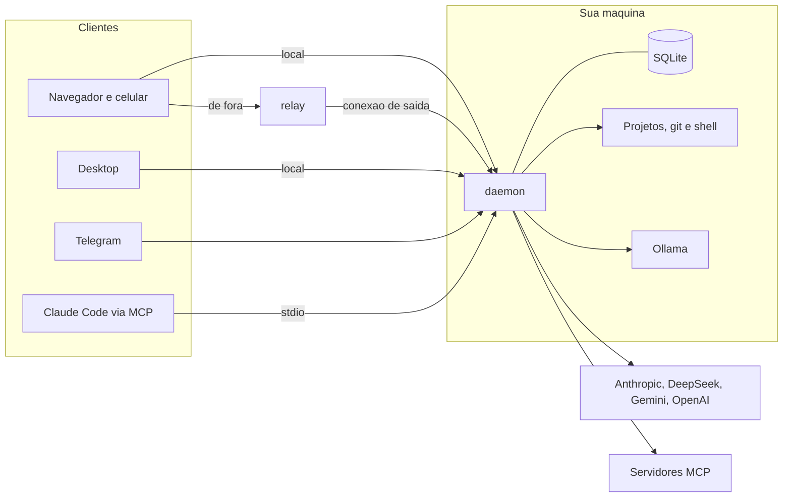

# Arquitetura

## As partes

| Parte | Repositorio | Papel |
|---|---|---|
| core | agent-hub-core | biblioteca: adaptadores de provedor, laco do agente, custo, roteamento, contexto, ferramentas, protocolo |
| daemon | agent-hub-daemon | processo Node na sua maquina; usa o core, guarda estado no SQLite e serve API e interface |
| interface | agent-hub-web | Vue 3 como PWA; so fala com o daemon |
| desktop | agent-hub-desktop | Tauri 2 em volta da interface |
| relay | agent-hub-relay | retransmissor sem estado para acesso de fora |
| canais | agent-hub-channels | Telegram sobre o mesmo protocolo |
| agentes | agent-hub-agents | configuracao em texto que o daemon le |

## Por que o daemon e separado da interface

- Todos os dispositivos precisam ver o mesmo estado. Se o laco rodasse na
  interface, cada um teria o proprio historico.
- Executar codigo a pedido do celular exige um processo sempre vivo na maquina.
- Chaves de API ficam num lugar so.

## O caminho de uma mensagem

1. O cliente manda `run.start` com o texto.
2. O daemon escolhe o agente: regra, classificador de intencao e pontuacao de
   capacidade contra custo e contexto. Se o melhorador de prompt estiver ligado,
   reescreve o pedido antes.
3. Monta o contexto: prompt do perfil, instrucoes e glossario do projeto,
   memoria ativada pelo pedido, historico da conversa (compactado se precisar).
4. Escolhe as ferramentas que cabem na janela do modelo, fixas para a sessao.
5. O laco do agente chama o modelo, valida cada chamada de ferramenta, aplica a
   politica, pede aprovacao quando precisa, executa, devolve o resultado e
   repete ate o modelo terminar, o orcamento acabar ou o limite de passos chegar.
6. Cada chamada ao modelo entra no ledger. Cada evento vai para os clientes com
   um numero de sequencia, para quem cair retomar do ponto certo.
7. Com a conversa parada, o daemon escreve o ponto de retomada.

## Estado

Tudo que importa fica no SQLite do daemon, em `~/.agent-hub/`: sessoes,
mensagens, eventos, ledger, aprovacoes, agendamentos, gatilhos, dispositivos,
cofre de chaves, base de conhecimento e midia por hash.

## Decisoes registradas

As decisoes de arquitetura estao em ADRs no repositorio
[agent-hub-docs](https://github.com/raylison100/agent-hub-docs/tree/main/adr):
TypeScript com adaptadores proprios, Tauri, daemon como fonte da verdade, relay
proprio e a recusa da compactacao feita pelo servidor do provedor.
