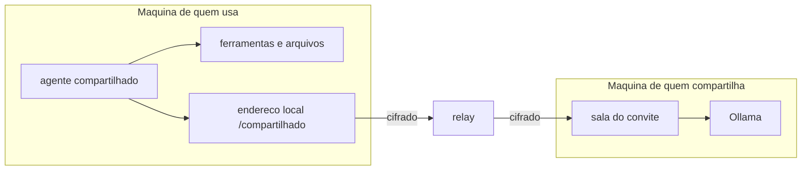

# Compartilhar modelos

Pessoas de confianca podem usar os modelos do Ollama umas das outras. Quem tem uma
placa boa libera alguns modelos; quem recebe o convite ganha um agente novo que
roda na maquina de quem compartilhou.

## O que atravessa e o que fica

- **Atravessa o relay:** so a chamada ao modelo (as mensagens da conversa e a
  resposta).
- **Fica na maquina de quem usa:** as ferramentas, os arquivos, as aprovacoes, o
  historico, o roteamento e o ledger.
- **Quem compartilha ve os pedidos.** E a placa dele que processa, entao ele tem
  acesso ao texto das mensagens. Por isso e para pessoas de confianca.

Tudo passa cifrado de ponta a ponta: o relay encaminha sem conseguir ler.

## Compartilhar os seus

Precisa de um relay configurado (`relay_url` no `config.toml`).

1. Configuracoes, **Compartilhar modelos**, secao "Compartilhar os meus".
2. Nome da pessoa, modelos liberados, limite de tokens por dia e janela.
3. **Gerar convite** e mande o texto so para essa pessoa, por um canal privado.

Cada convite tem a propria sala e a propria chave no relay. Revogar fecha a sala
na hora e nao afeta os outros convites. A lista mostra o uso de cada convidado
no dia e se a sala esta no ar.

## Usar os de alguem

1. Configuracoes, **Compartilhar modelos**, secao "Modelos que recebi".
2. Cole o convite e escolha se o agente entra no roteamento automatico. Por
   padrao ele so e usado quando voce escolhe o agente.
3. **Testar** confere a conexao e mostra os modelos liberados.

Aparece um agente por modelo, com nome `compartilhado-<quem>-<modelo>`, custo
zero no seu ledger e a politica `padrao` (pede aprovacao para escrever e
executar).

## Limites que o anfitriao impoe

| Regra | O que acontece |
|---|---|
| modelo fora da lista do convite | recusado |
| qualquer caminho alem de `/v1/chat/completions` e `/v1/models` | recusado (nao da para mandar o Ollama baixar modelo nem listar os outros) |
| limite diario de tokens atingido | recusado ate o dia seguinte |
| outro pedido do mesmo convite em andamento | recusado, tente de novo em instantes |
| resposta maior que 8192 tokens | cortada no teto |

## Seguranca do lado de quem usa

- O token da sala fica cifrado no banco e nao entra no ambiente do processo, entao
  servidores MCP e comandos nao o herdam.
- O endereco local `/compartilhado/...` so atende a propria maquina.
- Se quem compartilha desligar ou revogar, o agente falha com a mensagem dizendo
  isso, e o resto do daemon segue normal.

## Testar

`daemon/scripts/compartilhamento/testar.sh` sobe um relay local e dois daemons
temporarios, faz o fluxo completo (o agente compartilhado le um arquivo que so
existe no convidado) e roda os testes de seguranca da tabela acima. Precisa do
Ollama com o modelo de `MODELO` (padrao `qwen3:8b`).
